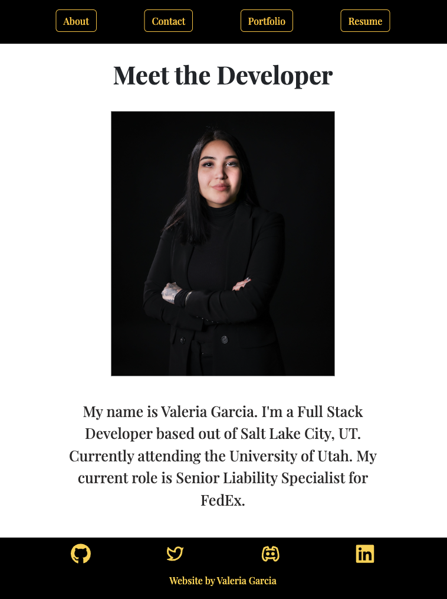

# react-portfolio-2.0 

## Description
The point this project is to showcase my skills and talents. 

## Table of Contents
- [Usage](#usage)
- [Lisence](#lisence)

## Usage
For me to showcase the kind of portfolio I can build and also give potentional employers the option to download my resume.

## License
MIT

## Contributing 
I got help from my tutor and TA's to help complete this as well as used npg's from Undraw.co.

## Github Repository Link
[link](https://github.com/vhivestate/react-portfolio-2.0)

## Screenshot

## Questions
 If you have any questions feel free to contact me [via email](mailto:garcia.valeria001@gmail.com). or [on GitHub](https://github.com/vhivestate).